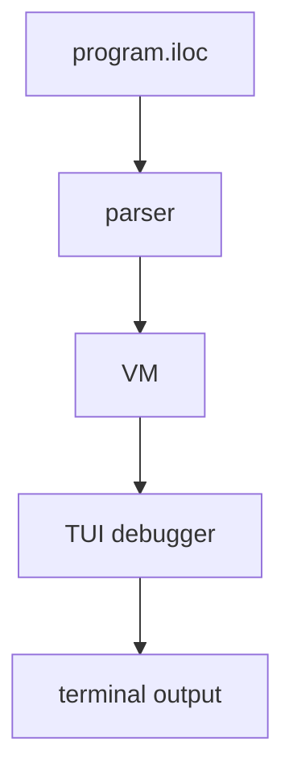

# iloc-emulator

> This project was submitted as the final project for the Compiler Construction course in Software Engineering Program.

A terminal-based **ILOC** (Intermediate Language for Object Code) emulator with an interactive TUI debugger. The emulator executes ILOC assembly programs on a virtual machine and provides real-time visualisation of registers, memory, and program execution via a [ratatui](https://github.com/ratatui/ratatui)-powered interface.

---

## Table of Contents

- [Overview](#overview)
- [Architecture](#architecture)
- [ILOC Instruction Set](#iloc-instruction-set)
  - [Arithmetic Operations](#arithmetic-operations)
  - [Immediate Arithmetic Operations](#immediate-arithmetic-operations)
  - [Bitwise Operations](#bitwise-operations)
  - [Data Transfer Operations](#data-transfer-operations)
- [TUI Debugger](#tui-debugger)
- [Example](#example)
- [Prerequisites](#prerequisites)
- [Building & Running](#building--running)
- [Running Tests](#running-tests)

---

## Overview

The emulator reads an ILOC assembly file (`program.iloc`), parses it into instructions (stripping comments and whitespace), and executes them on a register-based virtual machine with a flat byte-addressable memory. A built-in TUI lets you step through instructions one at a time or run them continuously, inspecting register and memory state at each point.

---

## Architecture



The project is a single Rust crate with three modules:

| Module | Role |
|---|---|
| `parser` | Strips comments (`#`, `//`, `/* */`), normalises whitespace, and returns a list of instruction strings |
| `vm` | Register-based virtual machine with 1 KiB memory; executes ILOC instructions step-by-step |
| `tui` | Interactive terminal UI (ratatui + crossterm) showing program listing, registers, and hex memory dump |

---

## ILOC Instruction Set

All registers are virtual (`r0`, `r1`, `r2`, ...) and hold 32-bit signed integers (`i32`). Memory is byte-addressable and stores values in little-endian format.

### Arithmetic Operations

| Instruction | Syntax | Semantics |
|---|---|---|
| `nop` | `nop` | No operation |
| `add` | `add r1,r2 => r3` | `r3 <- r1 + r2` |
| `sub` | `sub r1,r2 => r3` | `r3 <- r1 - r2` |
| `mult` | `mult r1,r2 => r3` | `r3 <- r1 * r2` |
| `div` | `div r1,r2 => r3` | `r3 <- r1 / r2` (panics on division by zero) |

### Immediate Arithmetic Operations

| Instruction | Syntax | Semantics |
|---|---|---|
| `addI` | `addI r1,c2 => r3` | `r3 <- r1 + c2` |
| `subI` | `subI r1,c2 => r3` | `r3 <- r1 - c2` |
| `rsubI` | `rsubI r1,c2 => r3` | `r3 <- c2 - r1` |
| `multI` | `multI r1,c2 => r3` | `r3 <- r1 * c2` |
| `divI` | `divI r1,c2 => r3` | `r3 <- r1 / c2` (panics on division by zero) |
| `rdivI` | `rdivI r1,c2 => r3` | `r3 <- c2 / r1` (panics on division by zero) |

### Bitwise Operations

| Instruction | Syntax | Semantics |
|---|---|---|
| `lshift` | `lshift r1,r2 => r3` | `r3 <- r1 << r2` |
| `lshiftI` | `lshiftI r1,c2 => r3` | `r3 <- r1 << c2` |
| `rshift` | `rshift r1,r2 => r3` | `r3 <- r1 >> r2` |
| `rshiftI` | `rshiftI r1,c2 => r3` | `r3 <- r1 >> c2` |
| `and` | `and r1,r2 => r3` | `r3 <- r1 & r2` |
| `andI` | `andI r1,c2 => r3` | `r3 <- r1 & c2` |
| `or` | `or r1,r2 => r3` | `r3 <- r1 \| r2` |
| `orI` | `orI r1,c2 => r3` | `r3 <- r1 \| c2` |
| `xor` | `xor r1,r2 => r3` | `r3 <- r1 ^ r2` |
| `xorI` | `xorI r1,c2 => r3` | `r3 <- r1 ^ c2` |

### Data Transfer Operations

| Instruction | Syntax | Semantics |
|---|---|---|
| `loadI` | `loadI c1 => r2` | `r2 <- c1` (immediate load) |
| `load` | `load r1 => r2` | `r2 <- mem[r1]` |
| `loadAI` | `loadAI r1,c2 => r3` | `r3 <- mem[r1 + c2]` |
| `loadAO` | `loadAO r1,r2 => r3` | `r3 <- mem[r1 + r2]` |
| `cload` | `cload r1 => r2` | `r2 <- mem[r1]` (character load) |
| `store` | `store r1 => r2` | `mem[r2] <- r1` |
| `storeAI` | `storeAI r1 => r2,c3` | `mem[r2 + c3] <- r1` |
| `storeAO` | `storeAO r1 => r2,r3` | `mem[r2 + r3] <- r1` |

> **Note:** `cloadAI` and `cloadAO` are defined but are not implemented.

---

## TUI Debugger

The emulator includes an interactive terminal interface with three panels:

| Panel | Description |
|---|---|
| **Program** (left) | Displays the instruction listing; the current instruction is highlighted |
| **Registers** (top-right) | Shows all registers and their current values, sorted alphabetically |
| **Memory** (bottom-right) | Hex dump of memory in 8-byte rows with ASCII representation |

### Keybindings

| Key | Action |
|---|---|
| `s` | Step - execute one instruction |
| `r` | Run/Pause - toggle continuous execution |
| `q` | Quit |

---

## Example

**Input (`program.iloc`):**

```iloc
loadI 10 => r0
loadI 5 => r1
sub r0, r1 => r2
add r2, r1 => r2
mult r2, r1 => r2
div r2, r1 => r2
```

**Execution trace:**

| Step | Instruction | Result |
|---|---|---|
| 1 | `loadI 10 => r0` | `r0 = 10` |
| 2 | `loadI 5 => r1` | `r1 = 5` |
| 3 | `sub r0, r1 => r2` | `r2 = 5` |
| 4 | `add r2, r1 => r2` | `r2 = 10` |
| 5 | `mult r2, r1 => r2` | `r2 = 50` |
| 6 | `div r2, r1 => r2` | `r2 = 10` |

---

## Prerequisites

- [Rust](https://www.rust-lang.org/tools/install) (edition 2021, stable toolchain)
- Cargo (included with Rust)
- A terminal emulator that supports TUI rendering

---

## Building & Running

**Build the project:**

```sh
cargo build --release
```

**Run the emulator** (reads `program.iloc` from the current directory):

```sh
cargo run
```

---

## Running Tests

```sh
cargo test --all
```

The test suite covers arithmetic operations (`add`, `sub`, `mult`, `div`), immediate variants (`addI`, `subI`, `rsubI`, `multI`, `divI`, `rdivI`), bitwise operations (`lshift`, `lshiftI`, `rshift`, `rshiftI`), data transfer (`loadI`), and `nop`.
